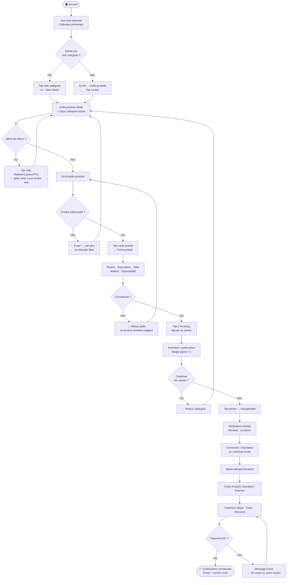
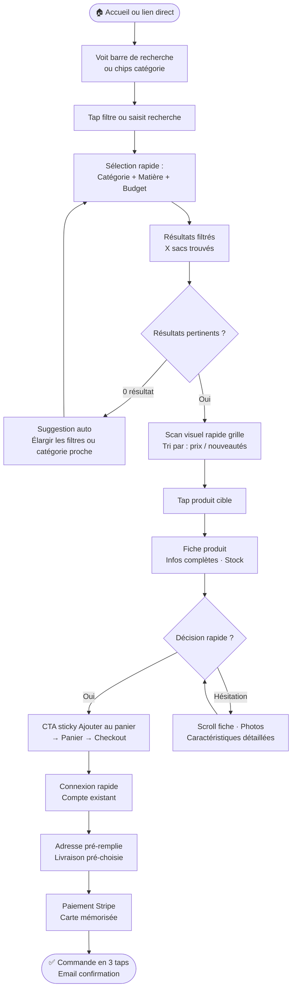
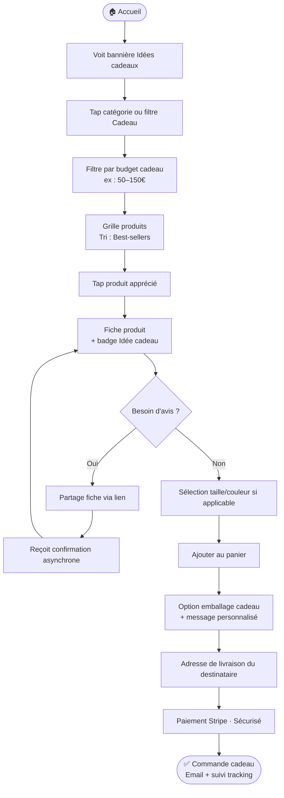

# UX Design Specification — mon-ecommerce

**Auteur :** Bouchta
**Date :** 2026-04-12

---

## Résumé Exécutif

### Vision du Projet

**mon-ecommerce** est une plateforme e-commerce verticale dédiée aux sacs et accessoires (mode, cuir, voyage, sport). La promesse UX centrale : *permettre à tout client de trouver exactement le sac qu'il cherche en moins de 2 minutes*. L'expérience d'achat guidée est le différenciateur principal — pas la technologie. Chaque décision UX doit servir cette promesse de rapidité et de fluidité.

La plateforme est multicanale : web (Angular 17+ avec SSR) et mobile natif (Flutter iOS/Android). L'UX doit être cohérente entre les deux canaux tout en respectant les patterns natifs de chaque plateforme.

### Utilisateurs Cibles

| Persona | Contexte | Besoin UX principal |
|---------|----------|---------------------|
| **Salma** (acheteuse pressée) | Mobile, 15 min disponibles, achat cadeau | Navigation rapide, filtres visuels, checkout ≤ 4 étapes |
| **Karim** (administrateur) | Desktop, gestion quotidienne | Back-office efficace, vue d'ensemble claire, actions rapides |
| **Ahmed** (client déçu) | Post-achat, veut retourner | Processus de retour sans friction, confiance préservée |
| **Visiteur anonyme** | Découverte passive, pas prêt à acheter | Catalogue explorable sans compte, envie de revenir |

### Défis UX Clés

1. **La découverte guidée** — le catalogue doit *conduire* l'acheteur vers le bon produit, pas se contenter de l'afficher. La page d'accueil et les filtres sont critiques.
2. **Le checkout sans friction** — chaque étape superflue coûte des conversions. Sur mobile, la tolérance est encore plus faible. ≤ 4 étapes, sans compte obligatoire.
3. **La cohérence multiplateforme** — web Angular et app Flutter doivent offrir la même logique d'expérience, avec des patterns d'interaction adaptés à chaque plateforme.

### Opportunités de Design

1. **Catégories visuelles en page d'accueil** — des visuels impactants (cuir · voyage · sport · mode) plutôt qu'un menu texte, pour déclencher l'envie immédiatement.
2. **Filtres en temps réel** — résultats mis à jour instantanément, sans rechargement, pour maintenir le flux de découverte.
3. **Fiche produit rassurante** — galerie multi-photos, dimensions précises, stock disponible, politique de retour visible — tout ce qui élimine le doute avant l'achat.

---

## Expérience Utilisateur Centrale

### Interaction Définissante

L'achat guidé en moins de 2 minutes est l'interaction la plus fréquente et la plus critique. Le parcours découverte → filtrage → fiche produit → panier → paiement est le cœur du produit. Tout le reste (retours, compte client, back-office) est secondaire. Une défaillance sur ce parcours central = une défaillance produit.

### Stratégie Plateforme

| Canal | Mode d'interaction | Rôle |
|-------|-------------------|------|
| Flutter mobile (iOS/Android) | Touch-first, gestes natifs, pouce dominant | Canal principal acheteurs |
| Angular web SSR | Souris/clavier + touch responsive | Principal admin, secondaire acheteurs |
| Hors-ligne | Non requis (V1) | — |
| Fonctionnalités device | Appareil photo uniquement (V1) | Secondaire |

### Interactions Sans Effort

- **Filtrer le catalogue** — un tap sur une catégorie, résultats instantanés sans rechargement visible
- **Ajouter au panier** — un bouton, une animation de confirmation, aucune interruption du flux
- **Checkout** — adresse pré-remplie pour clients connectés, paiement natif mobile (Apple Pay / Google Pay) en V2
- **Consulter une commande** — deux taps depuis le profil, sans recherche manuelle

### Moments de Succès Critiques

1. **"Je trouve ce que je cherche"** — les filtres réduisent le catalogue à 3-5 produits pertinents. L'acheteur réalise que la plateforme est faite pour lui.
2. **"C'est confirmé, c'est commandé"** — page de confirmation claire + email reçu immédiatement. Sentiment de sécurité établi.
3. **"Mon retour est accepté sans drama"** — formulaire simple, email reçu, remboursement tracé. Confiance rétablie malgré l'incident.
4. **"J'ai tout sous contrôle"** (admin) — dashboard qui donne la santé de la boutique en un coup d'œil.

### Principes d'Expérience

1. **Guider, pas lister** — chaque écran conduit vers l'action suivante, jamais vers une impasse
2. **Zéro friction aux moments critiques** — filtres et checkout ne ralentissent jamais l'acheteur
3. **La confiance se construit visuellement** — photos de qualité, stock affiché, politique de retour visible réduisent l'hésitation
4. **Mobile natif d'abord** — les compromis UX se font en faveur du mobile
5. **L'admin mérite aussi une bonne UX** — efficacité de gestion = boutique mieux tenue = plus de ventes

---

## Réponse Émotionnelle Souhaitée

### Objectifs Émotionnels Principaux

| Moment | Émotion cible |
|--------|--------------|
| Première visite | Curiosité + Confiance — "Ce site est fait pour moi" |
| Pendant la navigation | Fluidité + Plaisir — "Je trouve facilement" |
| Après l'achat | Sécurité + Satisfaction — "J'ai bien fait" |
| En cas de problème | Contrôle + Réassurance — "Je suis pris en charge" |
| Retour sur la boutique | Familiarité + Envie — "J'ai envie de voir les nouveautés" |

### Parcours Émotionnel

Découverte → [Curiosité] → Navigation guidée → [Confiance] → Filtres → [Plaisir de trouver] → Fiche produit → [Désir] → Checkout → [Fluidité] → Confirmation → [Soulagement + Satisfaction] → Livraison → [Excitation] → Retour éventuel → [Contrôle]

### Micro-Émotions

| Recherché | À éviter |
|-----------|----------|
| Confiance (photos authentiques, stock visible) | Scepticisme (manque d'infos produit) |
| Accomplissement (commande confirmée) | Frustration (checkout trop long) |
| Plaisir (navigation visuelle) | Anxiété (paiement incertain) |
| Contrôle (suivi commande clair) | Abandon (trop d'étapes imposées) |
| Surprise positive (livraison rapide) | Déception (écart photo / réalité) |

### Implications de Design

- **Confiance** → Photos produits haute qualité (≥ 6), dimensions précises, badge "Retour facile 14j" sur chaque fiche
- **Fluidité** → Filtres sans rechargement, panier persistant sans compte, auto-complétion adresse en checkout
- **Plaisir** → Animations légères sur ajout panier et confirmation, catégories visuelles impactantes en page d'accueil
- **Contrôle** → Statut commande visible en 2 taps, emails de suivi proactifs, retour en autonomie complète
- **Familiarité** → Page d'accueil personnalisée pour clients connectés (dernière commande, suggestions)

### Principes de Design Émotionnel

1. **Chaque écran réduit l'anxiété** — afficher suffisamment d'informations pour décider sans hésiter
2. **Célébrer les succès** — la confirmation de commande est un moment positif, pas une page de remerciement froide
3. **Les erreurs ne surprennent pas** — messages clairs, options de récupération immédiates
4. **Le soin se voit dans les détails** — micro-animations soignées, transitions fluides, typographie lisible

---

## Analyse UX & Inspiration

### Produits Inspirants

**Sézane** — référence du sobre premium français
- Navigation épurée, espace blanc généreux
- Photographie éditoriale (sac posé, porté, détails matière)
- Fiche produit sans distraction : image grande, titre, prix, couleurs → bouton
- Mobile impeccable : scroll vertical fluide, menu caché par défaut

**Longchamp** — premium accessible, international
- Palette sobre (noir, beige, blanc)
- Filtres discrets (barre latérale desktop, bottom sheet mobile)
- Fiche produit rassurante : matière, dimensions, fabrication, livraison tout visible

**A.P.C.** — minimalisme typographique
- Typographie comme élément de design principal
- Peu de couleurs, beaucoup d'espace
- Le produit parle de lui-même, sans surcharge visuelle

### Patterns UX Transférables

**Navigation**
- Menu principal minimaliste (3-4 catégories max visibles)
- Filtres en panel latéral discret (desktop) ou bottom sheet (mobile)
- Barre de recherche accessible mais non intrusive

**Fiche Produit**
- Image dominante (70% de l'écran sur mobile), galerie swipeable
- Informations hiérarchisées : nom → prix → couleur → taille → CTA → détails matière → livraison/retour
- Bouton "Ajouter au panier" sticky en bas sur mobile

**Checkout**
- Fond blanc, typographie noire, zéro décoration
- Indicateur de progression sobre (étapes numérotées)
- Résumé commande collapsible pour maintenir le focus

**Identité Visuelle**
- Palette : blanc, noir, couleur d'accent neutre (beige, gris chaud ou vert sauge)
- Typographie : serif élégant pour les titres, sans-serif clean pour le contenu
- Espace blanc généreux — le produit respire

### Anti-Patterns à Éviter

| Anti-pattern | Raison |
|-------------|--------|
| Pop-ups agressifs (newsletter, promo) | Casse immédiatement l'ambiance sobre |
| Bannières de réduction clignotantes | Signal "discount" incompatible avec l'image premium |
| Surcharge de couleurs ou animations | Distrait du produit, qui doit être la star |
| Navigation avec 10+ catégories visibles | Sentiment de désorganisation |
| Photos produit de mauvaise qualité | Trahit l'ambiance boutique de marque |

### Stratégie Design

| Décision | Choix |
|----------|-------|
| **Adopter** | Espace blanc généreux, typographie hiérarchisée, images éditoriales, palette neutre |
| **Adapter** | Panel de filtres simplifié, adapté aux contraintes Flutter/Angular |
| **Éviter** | Gamification, badges promo agressifs, surcharge visuelle |

**Positionnement visuel cible :** sobre et professionnel, registre "boutique de marque" — le produit est la star, l'interface s'efface.

---

## Fondation du Système de Design

### Choix du Système de Design

| Canal | Système choisi |
|-------|---------------|
| **Web (Angular)** | Tailwind CSS + Angular CDK |
| **Mobile (Flutter)** | Material 3 fortement thémé |

### Justification

**Web — Tailwind CSS + Angular CDK :**
Tailwind permet un contrôle pixel-perfect de l'espace blanc, de la typographie et des couleurs sans imposer de composants pré-stylés. Angular CDK fournit les comportements (overlay, dialog, accessibility) sans style. Cette combinaison garantit un rendu sobre et épuré, cohérent avec le positionnement "boutique de marque".

**Mobile — Material 3 thémé :**
Material 3 est le système natif Flutter le plus avancé. Avec une customisation approfondie du ThemeData (couleurs, typographie, formes), il devient méconnaissable et produit une expérience premium. C'est l'approche adoptée par de grandes marques sur Flutter.

### Tokens de Design

| Élément | Valeur |
|---------|--------|
| Couleur principale | Blanc #FFFFFF |
| Couleur texte | Noir #111111 |
| Couleur d'accent | Neutre à définir (beige doré, gris chaud ou vert sauge) |
| Typographie titres | Serif élégant (Playfair Display ou Cormorant Garamond) |
| Typographie contenu | Sans-serif clean (Inter ou DM Sans) |
| Coins | Arrondis 4–8px |
| Espacement base | Système 8px, espaces généreux entre sections |
| Icônes | Outline fin (Lucide Icons ou Material Symbols Outlined) |

### Stratégie de Personnalisation

- Composants de base (boutons, inputs, cards) personnalisés via le ThemeData Flutter et les classes Tailwind
- Composants custom uniquement pour les éléments spécifiques au domaine (fiche produit, galerie, filtre)
- Design tokens partagés entre web et mobile pour garantir la cohérence cross-canal

---

## Expérience Utilisateur Définissante

### Interaction Centrale

**"Filtrer et trouver le sac parfait en 3 taps"** — c'est l'interaction que les utilisateurs décriront à leurs proches. Le filtre guidé est l'âme du produit.

### Modèle Mental de l'Utilisateur

Les acheteurs arrivent avec le modèle mental d'une boutique physique : ils savent vaguement ce qu'ils veulent (sac cuir, marron, pas trop grand) mais ont besoin d'être guidés. Ils n'ont pas les références exactes.

- **Attentes :** catégories visuelles claires, filtres formulés comme des questions naturelles (matière, couleur, budget)
- **Frustrations habituelles :** formulaires de recherche avancée complexes, menus à 15 options, résultats vides sans alternative

### Critères de Succès

| Critère | Mesure |
|---------|--------|
| Vitesse | Produit trouvé en ≤ 3 interactions depuis la page d'accueil |
| Pertinence | Résultats filtrés toujours cohérents avec la requête |
| Fluidité | Zéro rechargement visible lors de l'application des filtres |
| Guidage | Jamais face à 0 résultats sans alternative proposée |

### Patterns UX Adoptés

Le filtre facetté est un pattern e-commerce éprouvé. L'innovation est dans l'exécution : rapidité, design sobre, filtres pertinents pour le domaine sacs.

- **Chips de filtre** sélectionnables (tap = actif/inactif, visible en haut de liste)
- **Grille 2 colonnes** sur mobile, 3-4 colonnes sur desktop
- **Bottom sheet filtres** sur mobile (drawer du bas)
- **Badge compteur** sur l'icône filtre ("Filtres (2)")

### Mécanique de l'Expérience

**1. Initiation :** Page d'accueil avec 4 tuiles visuelles (Cuir · Voyage · Sport · Mode) + barre de recherche

**2. Interaction :** Grille de produits affichée immédiatement → bottom sheet filtres (Matière / Couleur / Prix / Nouveautés) → mise à jour en temps réel à chaque sélection

**3. Feedback :** Compteur de résultats mis à jour ("12 sacs trouvés") · Chips actifs visibles · Si 0 résultats : suggestion "Élargir les filtres" automatique

**4. Complétion :** Tap sur produit → fiche produit → bouton "Ajouter au panier" sticky → animation de confirmation → badge panier mis à jour

---

## Fondation Visuelle

### Système de Couleurs

| Rôle | Couleur | Code hex |
|------|---------|----------|
| Fond principal | Blanc pur | `#FFFFFF` |
| Texte principal | Noir profond | `#111111` |
| Texte secondaire | Gris charbon | `#555555` |
| Accent / CTA | Beige doré | `#C9A96E` |
| Accent survol | Beige foncé | `#A8864A` |
| Fond secondaire | Crème ivoire | `#FAF8F5` |
| Bordures | Gris clair | `#E5E5E5` |
| Succès | Vert sauge | `#6B8F71` |
| Erreur | Terracotta | `#C0564A` |

Palette "Élégance Naturelle" — le beige doré évoque le cuir naturel, cohérent avec le catalogue sacs. Sobre et chaleureux.

### Système Typographique

| Rôle | Police | Taille | Poids |
|------|--------|--------|-------|
| Titre H1 | Cormorant Garamond | 32–48px | 400 Regular |
| Titre H2 | Cormorant Garamond | 24–32px | 500 Medium |
| Titre H3 | DM Sans | 18–20px | 600 SemiBold |
| Corps de texte | DM Sans | 14–16px | 400 Regular |
| Labels / Prix | DM Sans | 13–14px | 500 Medium |
| Boutons | DM Sans | 14px | 600 SemiBold + letterspacing +0.5px |
| Captions | DM Sans | 12px | 400 Regular |

Duo typographique : Cormorant Garamond (serif élégant pour les titres) + DM Sans (sans-serif lisible pour le contenu). Registre luxe accessible.

### Espacement & Layout

| Élément | Valeur |
|---------|--------|
| Base de la grille | 8px |
| Espacement compact | 4px / 8px |
| Espacement standard | 16px / 24px |
| Espacement généreux | 32px / 48px / 64px |
| Marges page mobile | 16px |
| Marges page desktop | 24–40px |
| Largeur max contenu | 1280px |
| Grille desktop | 12 colonnes |
| Grille mobile | 4 colonnes |
| Rayon des coins | 4px (cards, inputs) · 2px (boutons) |

### Accessibilité Visuelle

| Critère | Valeur |
|---------|--------|
| Contraste texte/fond | `#111111` sur `#FFFFFF` = 18.1:1 ✅ AAA |
| Taille police minimum | 14px |
| Focus visible | Outline beige doré 2px, offset 2px |
| Touch targets | Hauteur minimum 44px sur mobile |

---

## Design Direction Decision

### Directions Explorées

Six directions visuelles ont été explorées via un showcase HTML interactif (`ux-design-directions.html`) : Éditorial Minimaliste (D1), Boutique Luxe (D2), Architecture Moderne (D3), Artisanal Chaleureux (D4), Fashion Forward (D5) et Intemporel Classique (D6). Chacune appliquait la palette Élégance Naturelle et le système typographique Cormorant Garamond + DM Sans, avec des approches différentes de grille, densité et navigation.

### Direction Choisie

**D1 — Éditorial Minimaliste** comme base principale, complétée par les patterns de filtrage de **D3 — Architecture Moderne**.

- Topbar légère, logo Cormorant Garamond espacé, navigation uppercase DM Sans
- Hero éditorial deux colonnes : image pleine hauteur à gauche + contenu aéré à droite
- Grille produits 4 colonnes desktop (2 tablette, 1 mobile), ratio portrait 3:4, fond ivoire `#FAF8F5`
- Filtres chips sticky avec états actifs nets (empruntés à D3)
- CTA primaire : fond `#111111`, hover → beige doré `#C9A96E`

### Rationale Design

Cette direction correspond exactement au brief "sobre et professionnel, genre boutique de marque" et aux inspirations Sézane / Longchamp / A.P.C. Le blanc dominant et l'espace négatif donnent le statut boutique de marque immédiatement, sans ostentation. Les filtres D3 permettent de tenir la promesse UX centrale : trouver le bon sac en moins de 2 minutes. D2 a été écarté (trop sombre pour une marque naissante), D4 trop artisanal, D5 trop complexe pour la V1.

### Approche d'Implémentation

- **Tailwind CSS** : utilitaires whitespace, typography scale Cormorant, composants Angular CDK pour les overlays et le bottom sheet mobile
- **Tokens design** appliqués globalement via CSS custom properties
- **Grille responsive** : 4 colonnes desktop → 2 colonnes tablette → 1 colonne mobile
- **Filtres** : sticky bar desktop, bottom sheet Material CDK sur mobile
- **Images** : format WebP, ratio 3:4 imposé, lazy loading natif Angular 17+

---

## User Journey Flows

Trois parcours critiques ont été conçus en s'appuyant sur les personas du PRD (Salma, Karim, Ahmed) et la direction design D1+D3.

### J1 — Salma : Découverte & Achat

Salma entre sans idée précise. Elle est attirée par le hero éditorial, explore par catégorie ou via la grille, affine avec les filtres chips et convertit après consultation de la fiche produit.

### J2 — Karim : Recherche Ciblée & Express

Karim sait ce qu'il veut. Il filtre directement par catégorie + matière + budget, scanne la grille, tape le bon produit et finalise en 3 étapes grâce à son compte et sa carte mémorisée.

### J3 — Ahmed : Cadeau & Achat Assisté

Ahmed achète pour quelqu'un. Il filtre par budget cadeau, consulte les best-sellers, peut partager la fiche pour avis externe, puis finalise avec option emballage cadeau et adresse du destinataire.

### Patterns de Navigation

- **Chips de filtres persistants** — toujours visibles en haut de la grille, état actif clairement différencié
- **Retour grille immédiat** — bouton retour depuis la fiche produit ramène à la même position dans la grille
- **Fil d'Ariane discret** — Accueil › Catégorie › Produit, sans surcharger l'interface

### Patterns de Feedback

- **Compteur temps réel** — "X sacs trouvés" mis à jour à chaque activation de filtre, sans rechargement
- **Badge panier animé** — animation subtile +1 à chaque ajout, visible depuis toutes les pages
- **Email systématique** — confirmation commande avec numéro de suivi, template sobre et professionnel

### Gestion des Erreurs & Récupération

| Situation | Comportement |
|-----------|-------------|
| 0 résultat filtre | Suggestion automatique "Élargir les filtres" + catégorie proche |
| Paiement échoué | Message d'erreur clair + re-saisie sans perte du panier |
| Session expirée | Reprise du panier après reconnexion, zéro perte |
| Stock épuisé | Signalement proactif sur la fiche + "Me prévenir" optionnel |

### Principes d'Optimisation des Flux

- **Minimiser les étapes** — max 5 taps de l'accueil à la confirmation de commande
- **Réduire la charge cognitive** — un seul choix à faire par écran, pas de formulaires longs
- **Progression visible** — indicateur d'étapes au checkout (Panier → Livraison → Paiement → Confirmation)
- **Récupération gracieuse** — jamais d'impasse ; toujours une sortie ou une alternative proposée

---

## Component Strategy

### Composants du Design System (Natifs)

| Composant | Source | Usage |
|-----------|--------|-------|
| Boutons, inputs, selects | Tailwind / Material 3 | Partout |
| Modales / dialogs | Angular CDK Overlay | Connexion, confirmations |
| Bottom sheet | Material CDK | Filtres mobile |
| Snackbar / toast | Material | Feedback actions |
| Skeleton loader | Material | Chargement grille |
| Breadcrumb | Tailwind custom | Navigation catalogue |

### Composants Custom

#### ProductCard
**Rôle :** Unité atomique de tout le catalogue — présente un produit dans la grille.
**Anatomy :** Image 3:4 · Badge (Nouveau / Promo) · Marque · Nom · Matière · Prix
**États :** Default · Hover (scale 1.02, ombre légère) · Favoris actif · Rupture stock (overlay grisé + mention)
**Variants :** Grid card (compact, grille 4 col) · List card (horizontal, mode liste) · Featured card (large, hero catégorie)
**Accessibilité :** `role="article"`, `aria-label="[Nom], [prix]"`, focus ring beige doré 2px

#### FilterChipBar
**Rôle :** Interface de filtrage principal — critique pour la promesse "trouver en 2 minutes".
**Anatomy :** Chips scrollables horizontalement · Badge compteur résultats · Bouton reset "Tout effacer"
**États :** Default · Actif (fond `#111111`, texte blanc) · Hover · Disabled
**Variants :** Desktop sticky bar (sous topbar) · Mobile → déclenche bottom sheet filtres
**Accessibilité :** `role="group"`, `aria-pressed` sur chaque chip, annonce compteur via `aria-live`

#### ProductGallery
**Rôle :** Galerie photos immersive sur la fiche produit — renforce la confiance d'achat.
**Anatomy :** Image principale · Thumbnails cliquables · Dots mobile · Zoom hover desktop
**États :** Loading skeleton · Chargé · Zoom actif (loupe)
**Variants :** Desktop (thumbnails en colonne gauche) · Mobile (swipe horizontal + dots)
**Accessibilité :** `aria-roledescription="carousel"`, navigation clavier ←/→, `aria-label` sur chaque image

#### StickyAddToCart
**Rôle :** CTA persistant sur la fiche produit — déclencheur de conversion principal.
**Anatomy :** Prix · Sélecteur couleur/taille (si applicable) · Bouton "Ajouter au panier" · Indicateur stock
**États :** Default · Loading (spinner inline) · Succès (animation +1, badge panier) · Rupture (disabled + "Me prévenir")
**Variants :** Sticky bottom mobile · Inline desktop (colonne droite fiche)
**Accessibilité :** `aria-live` sur message succès, `aria-disabled` si rupture, label complet sur le bouton

#### CartDrawer
**Rôle :** Panier slide-in — évite une page dédiée et maintient le contexte de navigation.
**Anatomy :** Header (fermer + titre + compteur) · Liste articles · Sous-total · CTA "Finaliser la commande"
**États :** Vide (illustration + lien catalogue) · Rempli · Loading (checkout en cours)
**Variants :** Drawer latéral droit desktop · Bottom sheet mobile
**Accessibilité :** `role="dialog"`, `aria-modal="true"`, focus trap, fermeture Echap

#### OrderStepIndicator
**Rôle :** Barre de progression checkout — réduit l'anxiété et indique où l'utilisateur en est.
**Anatomy :** Steps numérotés · Ligne de connexion · Label étape
**États :** Complété (or + icône check) · Actif (noir) · À venir (gris)
**Variants :** Horizontal desktop · Compact mobile (dots)
**Accessibilité :** `aria-current="step"` sur l'étape active, labels visibles

### Stratégie d'Implémentation

**Web (Angular 17+) :** Composants standalone, stylés Tailwind, comportements Angular CDK. CSS custom properties pour les tokens design. Documentation Storybook optionnelle en V2.

**Mobile (Flutter) :** Mêmes composants re-implémentés en widgets Flutter stateless/stateful, thémés Material 3. Fichier `design_tokens.dart` pour partager les valeurs de tokens.

### Roadmap Composants

**Phase 1 — Catalogue (MVP, bloquant)**
- `ProductCard` — J1, J2, J3 en dépendent
- `FilterChipBar` — promesse "2 minutes" impossible sans
- `StickyAddToCart` — conversion directe

**Phase 2 — Conversion**
- `ProductGallery` — améliore la décision d'achat sur fiche
- `CartDrawer` — fluidifie le passage checkout
- `OrderStepIndicator` — réduit l'abandon au checkout

**Phase 3 — Enrichissement V1+**
- Wishlist button intégré dans `ProductCard`
- GiftWrap selector (parcours Ahmed)
- StockAlert widget (rupture → notification email)

---

## UX Consistency Patterns

### Hiérarchie des Boutons

| Niveau | Usage | Apparence |
|--------|-------|-----------|
| **Primaire** | Action principale (Ajouter au panier, Payer) | Fond `#111111` · texte blanc · hover fond `#C9A96E` texte noir |
| **Secondaire** | Action alternative (Continuer les achats, Retour) | Bordure `#111111` · fond transparent · hover : fond `#111111` texte blanc |
| **Tertiaire** | Action faible (Voir détails, Partager) | Texte seul + underline fine, pas de fond ni bordure |
| **Destructeur** | Supprimer article, annuler | Texte `#C0564A` · confirmation requise avant exécution |

Règle absolue : jamais plus d'un bouton primaire par vue. Sur mobile, les boutons primaires sont toujours pleine largeur.

### Patterns de Feedback

| Situation | Composant | Message | Durée |
|-----------|-----------|---------|-------|
| Ajout panier réussi | Snackbar bas + badge +1 | "Tote Parisienne ajoutée au panier" | 3s auto-dismiss |
| Commande confirmée | Page dédiée + email | "Merci ! Commande #1234 confirmée" | Persistant |
| Erreur paiement | Inline sous formulaire | "Paiement refusé. Vérifiez vos informations." | Jusqu'à correction |
| 0 résultat filtre | Inline dans grille | "Aucun sac trouvé — Élargir les filtres" + bouton reset | Persistant |
| Stock épuisé | Badge ProductCard + fiche | "Rupture de stock" + "Me prévenir" | Persistant |
| Chargement | Skeleton cards (ratio identique produits) | — | Pendant fetch |

### Patterns de Formulaires

- **Validation :** Temps réel dès `onBlur`, jamais uniquement à la soumission. Erreur inline sous le champ en `#C0564A` avec icône ⚠.
- **Labels :** Toujours visibles au-dessus du champ. Champs obligatoires marqués `*`.
- **Checkout :** Formulaire multi-étapes (Adresse → Livraison → Paiement), sauvegarde automatique entre étapes, jamais tout sur une page.
- **Inputs :** Hauteur min 44px (touch target), border `#E5E5E5`, focus border `#C9A96E` 2px, border-radius 4px.

### Patterns de Navigation

- **Desktop :** Topbar sticky · logo gauche · navigation centrale uppercase · icônes droite · état actif en or `#C9A96E`
- **Mobile :** Topbar réduite (logo + burger + panier) · menu hamburger slide-in gauche
- **Retour :** Toujours disponible sur pages profondes — conserve la position de scroll et les filtres actifs
- **Pagination :** Infinite scroll avec bouton "Charger plus" explicite (pas de scroll infini automatique)

### Patterns d'États Vides

| Contexte | Message | Action proposée |
|----------|---------|----------------|
| Panier vide | "Votre panier est vide" | → "Découvrir notre catalogue" |
| Favoris vides | "Aucun article favori" | → "Explorer les collections" |
| 0 résultat recherche | "Aucun résultat pour « [terme] »" | → Suggestions de catégories |
| Commandes vides | "Aucune commande pour le moment" | → "Commencer à shopper" |

### Patterns Modal & Overlay

- **Ouverture :** Fade + slide-up mobile / fade desktop, 200ms
- **Fermeture :** Clic overlay · bouton X · touche Echap
- **Focus trap :** Focus maintenu dans la modal pendant toute son ouverture
- **Scroll body :** Bloqué quand overlay ouvert
- **Z-index :** Navigation 100 · Modales 200 · Toasts 300

### Patterns Recherche & Filtres

- **Recherche :** Suggestions dropdown dès 2 caractères (catégories + produits). Validation par Entrée ou tap.
- **Filtres actifs :** Chips supprimables individuellement, toujours visibles en haut de grille.
- **Reset global :** Bouton "Tout effacer" visible dès qu'un filtre est actif.
- **Persistance :** Filtres conservés si navigation vers fiche produit et retour.
- **Compteur :** "X sacs trouvés" mis à jour en temps réel sans rechargement.

---

## Responsive Design & Accessibilité

### Stratégie Responsive

Approche **mobile-first** — la majorité des achats mode se fait sur mobile. Le design est conçu à 375px puis progressivement élargi.

| Device | Comportement clé |
|--------|-----------------|
| **Mobile (< 768px)** | 1–2 col catalogue · bottom sheet filtres · topbar réduite · CTA sticky bas pleine largeur |
| **Tablette (768–1023px)** | 2–3 col catalogue · filtres drawer latéral · navigation visible · hero overlay |
| **Desktop (≥ 1024px)** | 4 col catalogue · filtres sticky bar · hero split 50/50 · max-width 1280px centré |

### Breakpoints Tailwind

| Préfixe | Valeur | Usage principal |
|---------|--------|----------------|
| *(aucun)* | 0px | Mobile first — base de tout style |
| `sm:` | 640px | Grille 2 colonnes, navigation visible |
| `md:` | 768px | Filtres sidebar, hero 2 colonnes |
| `lg:` | 1024px | 3 col catalogue, checkout 2 colonnes |
| `xl:` | 1280px | 4 col catalogue, max-width atteint |
| `2xl:` | 1536px | Padding augmenté, contenu reste à 1280px |

### Adaptations Clés par Composant

- **FilterChipBar :** sticky bar desktop → bottom sheet Material CDK mobile
- **StickyAddToCart :** fixe bas pleine largeur mobile → colonne droite inline desktop
- **CartDrawer :** bottom sheet mobile → panel latéral 400px desktop
- **ProductCard :** 1–2 col mobile → 4 col desktop, hover states desktop uniquement
- **ProductGallery :** swipe horizontal mobile → thumbnails colonne gauche desktop

### Stratégie Accessibilité — WCAG 2.1 AA

Cible légale : **WCAG 2.1 niveau AA** (RGAA en France, obligatoire e-commerce grand public).

| Critère | Implémentation |
|---------|---------------|
| **Contraste** | `#111111`/`#FFFFFF` = 18.1:1 ✅ AAA · `#C9A96E` jamais seul pour texte de corps (2.9:1) |
| **Taille texte** | Minimum 14px, corps 16px, zoomable 200% sans perte de contenu |
| **Touch targets** | Minimum 44×44px sur tous éléments interactifs mobile |
| **Focus visible** | Outline 2px `#C9A96E`, offset 2px, tous éléments interactifs |
| **Navigation clavier** | Tab order logique, Echap ferme modales, ←/→ galerie |
| **ARIA** | Landmarks (`main`, `nav`, `aside`), labels icônes, `aria-live` filtres/compteur |
| **Images produits** | `alt` descriptif systématique ("Tote Parisienne en cuir cognac, vue de face") |
| **Formulaires** | Labels liés, erreurs via `aria-describedby`, pas de CAPTCHA visuel |
| **Skip link** | "Aller au contenu principal" — premier élément focusable de chaque page |

**Note :** L'or `#C9A96E` est réservé aux accents visuels et états actifs — jamais comme seul vecteur d'information textuelle.

### Stratégie de Test

**Responsive :** Devices réels (iPhone 13 375px, Samsung S21 360px, iPad 768px, desktop 1440px) · Chrome, Firefox, Safari, Edge · Angular DevTools + Tailwind inspector

**Accessibilité :** axe-core intégré Angular · Lighthouse CI · VoiceOver iOS/macOS · TalkBack Android · NVDA Windows · navigation clavier complète à chaque sprint · simulation daltonisme Chrome DevTools

### Guidelines Implémentation

**Angular / Web :**
- Tailwind mobile-first : classes sans préfixe = mobile, `sm:/md:/lg:` = breakpoints supérieurs
- Unités relatives : `rem` pour typography, `%` et `vw/vh` pour layouts
- Images : `loading="lazy"` + `srcset` WebP + `alt` systématique
- Angular SSR : méta-tags + JSON-LD par page produit
- Angular CDK a11y : `FocusTrap`, `LiveAnnouncer`, `BreakpointObserver`

**Flutter / Mobile :**
- `LayoutBuilder` + `MediaQuery` pour breakpoints
- `Semantics` widget sur tous composants custom, `ExcludeSemantics` sur décoratifs
- `ThemeData` : `textScaleFactor` respecté, jamais de texte à taille fixe
- `flutter_test` + `accessibility_test` pour tests automatisés a11y
